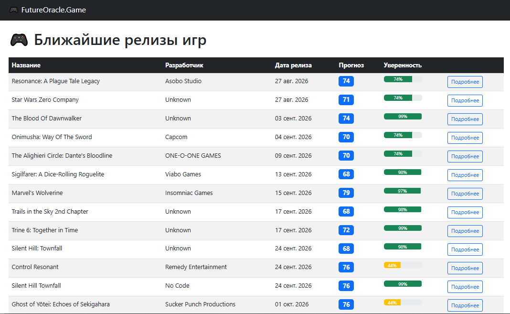
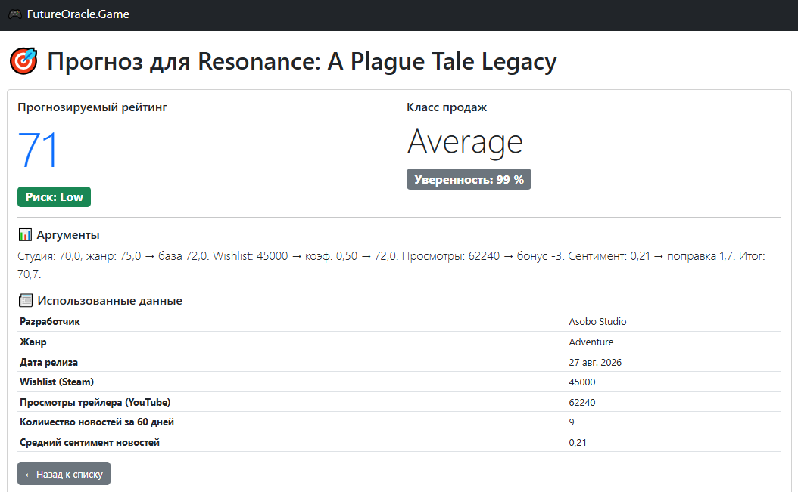
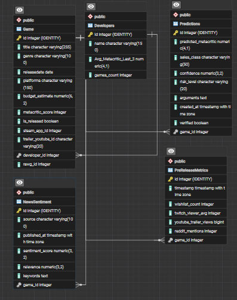

# FutureOracle.Game – предсказатель рейтинга игр

Прототип веб-приложения, которое прогнозирует **Metacritic-оценку** будущих релизов игр на основе данных о разработчике, жанре, популярности (Wishlist Steam, просмотры трейлеров на YouTube) и сентименте новостей.

---

## 📌 Тема прогнозов

**Область:** релизы компьютерных игр.  
**Что прогнозируем:** среднюю оценку (Metacritic) для игр, которые выйдут в ближайшие 3 месяца.  
**Почему это важно:** помогает оценить потенциальный успех игры до её выхода, что полезно для игроков, инвесторов и издателей.

---

## 📊 Использованные данные

| Источник | Тип данных | Как влияет на прогноз |
|----------|------------|------------------------|
| **RAWG API** | Список предстоящих игр, жанр, разработчик, трейлер, магазины | Основа для отбора игр, привязка к студии |
| **Steam Spy / SteamDB** | Количество желающих (Wishlist) | Отражает интерес игроков; влияет на поправочный коэффициент |
| **YouTube Data API** | Просмотры официального трейлера | Показывает уровень маркетинговой активности |
| **Google News RSS** | Новостные статьи об игре за последние 60 дней | Сентимент-анализ определяет общественное восприятие |
| **Hugging Face (DistilBERT)** | Сентимент-анализ текста новостей | Даёт числовую оценку тональности (положительная/отрицательная) |

---

## 🧠 Алгоритм прогноза (как считаются цифры)

1. **Базовый балл**  
   `Средний балл студии (за последние 3 игры) × 0.6 + Средний балл жанра (за 2 года) × 0.4`  
   > Студийный балл берётся из RAWG, жанровый – из собственной БД (релизы за 2 года).

2. **Коррекция по Wishlist**  
   Если Wishlist > 0, рассчитывается коэффициент `(Wishlist игры) / (медианный Wishlist по жанру)`, ограниченный от 0.5 до 2.0.  
   Балл умножается на `(0.9 + 0.2 × коэффициент)`.

3. **Бонус/штраф за просмотры трейлера**  
   - > 1 000 000 просмотров → +3 балла  
   - < 100 000 просмотров → –3 балла  
   (только если данные реальны)

4. **Поправка от сентимента новостей**  
   Усреднённый сентимент (взвешенный по релевантности) умножается на 10 и ограничивается от –10 до +10.

5. **Итоговый прогноз** = `clamp(база + бонусы + поправка, 0, 100)`

---

## 🎯 Уверенность и риск

- **Уверенность** рассчитывается как `(1 – норм. разброс компонентов) × полнота данных`.  
  Полнота = 20% (студия+жанр) + 30% (Wishlist) + 25% (YouTube) + 25% (новости).  
  В коде добавлено ограничение максимальной уверенности **80%** (реалистичный потолок), а для разработчиков с именем "Unknown" применяется штраф 15% (снижение уверенности).

- **Риск** (High/Medium/Low) зависит от уверенности и полноты данных.  
  Например, если использовано менее 60% источников → High риск.

- **Аргументы** в карточке прогноза честно перечисляют, какие данные были доступны, а какие нет.

---

## 🏗 Архитектура (слои, SOLID, DDD)

Проект построен по принципам **чистой архитектуры** и **DDD**:

| Слой | Назначение |
|------|------------|
| **Domain** | Сущности (`Game`, `Developer`, `Prediction`, `PreReleaseMetrics`, `NewsSentiment`) и интерфейсы репозиториев |
| **Application** | DTO, интерфейсы сервисов, реализация бизнес-логики (`PredictionService`, `GenreStatsService`) |
| **Infrastructure** | Клиенты API (RAWG, Steam, YouTube, News), репозитории (EF Core), фоновый сбор данных (`DataUpdateWorker`) |
| **Web** | Razor Pages, Controllers, Swagger, DI-контейнер |

**Ключевые паттерны:**
- **Dependency Injection** – всё внедряется через конструкторы.
- **Repository + Unit of Work** – работа с БД через репозитории.
- **BackgroundService** – автоматическое обновление данных каждые 6 часов.
- **Polly** – повторные попытки при сбоях внешних API.

---

## 🛠 Стек технологий и библиотек

| Технология / Библиотека | Версия | Назначение |
|-------------------------|--------|------------|
| **.NET** | 10.0 | Платформа |
| **ASP.NET Core** | 10.0 | Веб-фреймворк (Razor Pages, Web API) |
| **Entity Framework Core** | 10.0.11 | ORM для работы с PostgreSQL |
| **PostgreSQL** | 16+ | База данных |
| **Npgsql** | 10.0.3 | Провайдер для PostgreSQL |
| **Polly** | 8.7.0 | Повторные попытки при HTTP-запросах |
| **Microsoft.Extensions.Http.Polly** | 8.7.0 | Интеграция Polly с HttpClient |
| **Hugging Face API** | – | Сентимент-анализ (модель DistilBERT) |
| **RAWG API** | – | Источник игр и их метаданных |
| **Steam Spy API** | – | Получение Wishlist |
| **YouTube Data API v3** | – | Получение просмотров трейлеров |
| **Google News RSS** | – | Источник новостей (безлимитный) |
| **Swashbuckle** | – | Swagger UI для тестирования API |
| **AngleSharp** | – | HTML-парсинг SteamDB (резерв) |

---

## 🚀 Как запустить (локально)

1. **Клонировать репозиторий**
   ```bash
   git clone https://github.com/Vilt01/FutureOracle.Game.git
   cd FutureOracle.Game
   ```

2. **Установить PostgreSQL** (если ещё нет) и создать базу данных с именем `postgres` (или изменить строку подключения в `appsettings.json`).

3. **Настроить ключи API**  
   В файле `GamePredictor.Web/appsettings.json` замени заглушки на свои ключи:
   - `RAWG:ApiKey` – получить на [rawg.io](https://rawg.io/apidocs)
   - `Youtube:ApiKey` – получить в Google Cloud Console
   - (опционально) `HuggingFace:ApiKey` – получить на [huggingface.co](https://huggingface.co/settings/tokens)

4. **Восстановить пакеты и собрать**
   ```bash
   dotnet restore
   dotnet build
   ```

5. **Применить миграции БД**
   ```bash
   dotnet ef database update --project GamePredictor.Infrastructure --startup-project GamePredictor.Web
   ```

6. **Запустить приложение**
   ```bash
   dotnet run --project GamePredictor.Web
   ```

7. Открыть браузер по адресу `https://localhost:7149` (или порт из вывода консоли).

---

## 📸 Скриншоты

### 1. Главная страница (список игр)


### 2. Карточка прогноза


### 3. Схема базы данных


---

## 🗄 Структура базы данных

Схема базы данных описана в файле [Database/schema.sql](Database/schema.sql).

**Основные таблицы:**

- **Game** – информация об играх (название, жанр, дата релиза, разработчик, Steam App ID, YouTube ID)
- **Developers** – разработчики (средний балл за последние 3 игры, количество игр)
- **PreReleaseMetrics** – метрики популярности (Wishlist, просмотры на YouTube, упоминания в Reddit)
- **NewsSentiment** – новости и их сентимент-анализ
- **Predictions** – сохранённые прогнозы с уверенностью, риском и аргументами

---

## 🧪 Как проверить работу

1. На главной странице отобразится список предстоящих игр.
2. Нажми «Подробнее» у любой игры – откроется карточка с прогнозом.
3. Если данные ещё не загружены, нажми кнопку «Обновить данные» (или вызови POST `/api/admin/update` через Swagger).
4. После обновления появятся Wishlist, просмотры и новости, и прогноз пересчитается.

---

## 🔍 Что использовано из AI

- **Сентимент-анализ** – Hugging Face DistilBERT (бесплатный API) для оценки тональности новостей.
- **Поиск YouTube ID** – YouTube Data API v3 (использует AI для поиска релевантных видео).

---

## 📁 Структура репозитория

```
FutureOracle.Game/
├── GamePredictor.Application/       # бизнес-логика, DTO, интерфейсы
├── GamePredictor.Domain/            # сущности, интерфейсы репозиториев
├── GamePredictor.Infrastructure/    # клиенты API, репозитории, миграции
├── GamePredictor.Web/               # Razor Pages, Controllers, Program.cs
├── Screenshots/                     # скриншоты для README
│   ├── main-page.png
│   ├── details.png
│   └── db-schema.png
├── Database/                        # SQL-схема
│   └── schema.sql
├── .gitignore
├── GamePredictor.Web.slnx
└── README.md
```

---

## 📝 Итоговые комментарии

Проект демонстрирует:

- Работу с внешними API и агрегацию данных из нескольких источников.
- Построение прогностической модели с весами и объяснимыми аргументами.
- Чистую архитектуру, DI, репозитории, фоновые задачи.
- Честное отображение уверенности и риска на основе полноты данных.

**Задание сдано.**
```

---

## Что делать

1. Скопируй весь этот текст.
2. Открой файл `README.md` в корне репозитория на GitHub (нажми на него, потом на карандашик Edit).
3. Вставь этот текст вместо старого.
4. Внизу напиши `update README` и нажми **"Commit changes"**.

**Всё, репозиторий полностью готов к сдаче!** 🚀
